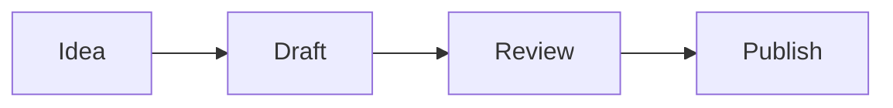

# Index

Source: index.md
URL: /

<LandingHome />

---

# First Launch

Source: start/first-launch.md
URL: /start/first-launch

# First Launch

The first launch flow is designed to get you into a real vault quickly without hiding the local-first model.

## What You Choose

Tolaria asks whether you want to:

- Create or clone the Getting Started vault.
- Open an existing local vault.
- Create a new empty vault.

The Getting Started vault is cloned locally and then disconnected from its remote. That keeps the sample safe to edit without accidentally pushing tutorial changes.

## What Tolaria Creates

Tolaria stores app-level settings on the local machine. Your notes stay in the vault folder you choose.

| Data | Stored in |
| --- | --- |
| Notes and attachments | Your vault folder |
| Type definitions and saved views | Your vault folder |
| Window size, zoom, recent vaults | Local app settings |
| Cache data | Rebuildable local cache |

## First Commands To Try

- `Cmd+K` / `Ctrl+K`: open the command palette.
- `New Note`: create a note in the current vault.
- `Open Getting Started Vault`: clone the public sample vault.
- `Reload Vault`: rescan files after external edits.

## AI Setup Prompt

Tolaria can show an optional AI agents prompt after a vault is open. It checks common local install locations for supported coding agents and gives you setup paths, but you can dismiss it and use Tolaria without AI.

---

# Getting Started Vault

Source: start/getting-started-vault.md
URL: /start/getting-started-vault

# Getting Started Vault

The Getting Started vault is a small public sample vault hosted at [refactoringhq/tolaria-getting-started](https://github.com/refactoringhq/tolaria-getting-started).

It exists to show Tolaria's conventions without requiring you to restructure your own notes first.

## What It Demonstrates

- Markdown notes with YAML frontmatter.
- Types such as Project, Person, Topic, and Procedure.
- Wikilinks in note bodies.
- Relationship fields in frontmatter.
- A local Git repository that can be connected to a remote later.
- Vault guidance files for AI agents.

## Local-Only By Default

When Tolaria clones the sample, it removes the remote from the local copy. This makes the sample vault disposable. You can edit it freely, commit locally, and delete it later.

To connect a vault to your own remote, use the bottom status bar remote chip or run `Add Remote` from the command palette.

Tolaria also repairs starter-vault guidance files when needed. `AGENTS.md` is the canonical guidance file, `CLAUDE.md` is kept as a compatibility shim, and `GEMINI.md` is only created when you explicitly restore Gemini guidance.

## Use It Alongside Your Own Vaults

You can keep the Getting Started vault open while working in your own notes. Enable `Settings` -> `Vaults` -> `Use multiple vaults at the same time`, then use the bottom-left vault menu to include both the sample vault and your real vault in the unified graph.

This lets search, quick open, note lists, backlinks, and wikilink navigation span both vaults. Git actions still stay scoped to each vault's own repository, and new notes go to the default vault you choose in `Manage vaults`.

## When To Move On

After you understand the sample, open your own vault. Tolaria does not require a special folder structure: a folder of Markdown files is enough to start. You can remove the sample from Tolaria's vault list later without deleting its files from disk.

---

# Install Tolaria

Source: start/install.md
URL: /start/install

# Install Tolaria

Tolaria publishes desktop builds for macOS, Windows, and Linux. macOS is the primary day-to-day development target, with Windows and Linux builds supported through the release pipeline and fixed as platform issues are found.

## Download

Use the latest stable release unless you are intentionally testing pre-release builds:

- <a href="https://tolaria.md/download/" target="_self">Download the latest stable build</a>
- [Browse all GitHub releases](https://github.com/refactoringhq/tolaria/releases)
- <a href="https://tolaria.md/releases/" target="_self">Read the release notes</a>

## Homebrew

On macOS you can install the cask:

```bash
brew install --cask tolaria
```

## Platform Status

| Platform | Status | Notes |
| --- | --- | --- |
| macOS | Primary | Apple Silicon and Intel builds are published. Homebrew is available. |
| Windows | Supported, early | NSIS installers and signed updater bundles are published. Some shell and menu behavior can still need Windows-specific fixes. |
| Linux | Supported, early | AppImage, deb, and RPM artifacts are published. Desktop behavior depends on distribution WebKitGTK and input-method integration. |

See [Supported Platforms](/reference/supported-platforms) for the current support policy.

## After Installing

1. Open Tolaria.
2. Choose the Getting Started vault if you want a guided sample.
3. Or open an existing folder of Markdown files as a vault.
4. Use the command palette with `Cmd+K` on macOS or `Ctrl+K` on Linux and Windows.

---

# Open Or Create A Vault

Source: start/open-or-create-vault.md
URL: /start/open-or-create-vault

# Open Or Create A Vault

A Tolaria vault is a folder on disk. The folder can contain Markdown notes, attachments, type definitions, saved views, and Git metadata.

## Open An Existing Folder

Choose an existing folder if you already have Markdown notes. Tolaria scans `.md` files and uses frontmatter when it exists.

Good starting points:

- A folder of plain Markdown files.
- An Obsidian-style vault.
- A Git repository containing notes.
- A copy of the Getting Started vault.

## Create A New Vault

Choose a new empty folder if you want Tolaria conventions from the start. New notes and optional type definitions are created as Markdown files.

## Use More Than One Vault

You do not have to merge everything into one folder. Register each local folder as its own vault, then turn on `Use multiple vaults at the same time` in `Settings` -> `Vaults`.

Once enabled, the bottom-left vault menu lets you include vaults in the unified graph. Search, quick open, wikilinks, and note lists can span the included vaults, while Git sync and commits remain tied to each vault's own repository.

## Git Is Recommended, Not Required

Tolaria works well with a plain folder of Markdown files. You can open, edit, organize, and search notes without making the vault a Git repository.

Git is recommended when you want local history, diff views, recovery, pull, push, and remote sync without a proprietary backend. If a vault is not already a repository, Tolaria can initialize one when you explicitly ask it to.

---

# AI

Source: concepts/ai.md
URL: /concepts/ai

# AI

Tolaria has two AI paths: coding agents that can use tools to inspect and edit a vault, and direct model targets that answer in chat mode from note context.

## Coding Agents

The AI panel can stream supported local CLI agents through Tolaria's normalized event layer. Current targets include Claude Code, Codex, OpenCode, Pi, and Gemini CLI when they are installed on the machine.

Coding agents can run in:

- **Vault Safe** mode, limited to file, search, and edit tools.
- **Power User** mode, which can allow local shell commands scoped to the active vault for agents that support shell access.

## Direct Models

Direct model targets run in chat mode. They receive the active note, linked context, and conversation history, but they do not receive vault-write tools or shell access.

Supported provider shapes include:

- Local models through Ollama or LM Studio.
- Hosted providers such as OpenAI, Anthropic, Gemini, and OpenRouter.
- Custom OpenAI-compatible endpoints.

## External MCP Setup

Tolaria exposes an MCP server for external tools. The setup flow can write Tolaria's MCP entry into Claude Code, Gemini CLI, Cursor, and a generic MCP config path, and it can also copy the exact JSON snippet for manual setup.

MCP setup is explicit. Closing the dialog leaves third-party config files untouched.

## Why Git Matters For AI

AI-generated changes should be inspectable. Git gives you diffs, history, rollback, and a clear boundary between suggestions and committed work.

---

# Editor

Source: concepts/editor.md
URL: /concepts/editor

# Editor

Tolaria offers a rich editor for daily writing and a raw Markdown mode for exact file control. Both modes write back to the same Markdown file.

## Rich Editing

The rich editor supports blocks, slash commands, wikilinks, tables, code blocks, images, Mermaid diagrams, LaTeX-style math, and markdown-backed whiteboards.

Use it when you want to write and reorganize quickly without thinking about Markdown syntax.

## Raw Mode

Raw mode shows the Markdown source directly. Use it when you need to edit YAML frontmatter, repair unusual Markdown, or make an exact text change.

Toggle raw mode with `Cmd+\` on macOS or `Ctrl+\` on Windows and Linux.

## Table Of Contents

The table of contents panel builds an outline from headings in the current note. It is useful for long notes, procedures, research files, and generated documents. Toggle it with `Cmd+Shift+T` on macOS or `Ctrl+Shift+T` on Windows and Linux.

## Width

Notes can use normal or wide editor width. Set the default in Settings, or override an individual note from the editor toolbar.

---

# Files And Media

Source: concepts/files-and-media.md
URL: /concepts/files-and-media

# Files And Media

Tolaria starts with Markdown notes, but a vault can also contain images, PDFs, media files, whiteboards, and other local files.

## Mermaid Diagrams

Use Mermaid code blocks when a note needs a diagram that should stay plain text and versionable.

````md

````

Tolaria renders Mermaid diagrams in the editor while keeping the source in Markdown.

## Attachments

Images pasted into the editor are saved into the vault as normal files. They remain portable and can be opened by other tools.

## Previews

Tolaria can preview common image files, PDFs, and supported media files in the app. Files without an in-app preview can still be opened in the default system app.

Settings control whether PDFs, images, and unsupported files appear in All Notes. Folder browsing still shows files in their folders.

## Whiteboards

Whiteboards use tldraw in the editor, but their durable representation stays in Markdown. That keeps them inside the vault and versioned by Git with the rest of your notes.

## Git Boundary

If generated or local-only files are ignored by Git, Tolaria can hide them from notes, search, quick open, and folders. Use this when build artifacts or private local files should not behave like vault content.

---

# Git

Source: concepts/git.md
URL: /concepts/git

# Git

Git is Tolaria's recommended history and sync layer. Tolaria can work with plain Markdown folders, and Git unlocks local history, recovery, remote backup, and multi-device workflows when you want them.

Tolaria acts as a lightweight Git client for your vault. You can review changes, commit, pull, push, and inspect history without leaving the app.

## What Tolaria Uses Git For

- Whole-vault commit history.
- Current diff for the vault.
- Per-note history.
- Current diff for an individual note.
- Pull and push.
- Conflict detection and resolution.
- Remote connection for local-only vaults.

## History And Diffs

Each note can show its own history and current diff, so you can understand how that file changed over time or what is unsaved relative to Git.

Tolaria also shows a history of the whole vault. Use it when you want to review broader changes across multiple notes before committing or syncing.

## Local Commits

You can commit changes inside Tolaria without leaving the app. This gives you useful restore points even before a remote is configured.

## Remotes

Connect a compatible Git remote when you want sync or backup. Tolaria relies on your system Git authentication, so GitHub CLI, SSH keys, credential helpers, and existing Git configuration can continue to work.

---

# Inbox

Source: concepts/inbox.md
URL: /concepts/inbox

# Inbox

The Inbox is for notes that have been captured but not yet organized.

## Why It Exists

Fast capture should not require perfect structure. The Inbox gives you a place to put incomplete notes, then process them later.

The Inbox workflow is optional. Turn it off in Settings > Workflow if you prefer every note to appear organized by default.

## Organizing Inbox Notes

When reviewing the Inbox:

1. Give the note a clear H1.
2. Set its `type`.
3. Add status, dates, or URL if useful.
4. Add relationships with wikilinks or frontmatter fields.
5. Move it into a folder only if the folder adds value.

## Healthy Inbox Habit

Keep the Inbox small enough that it can be reviewed in one focused pass. Tolaria works best when capture is fast and organization is deliberate.

---

# Notes

Source: concepts/notes.md
URL: /concepts/notes

# Notes

A note is a Markdown file with optional YAML frontmatter. Tolaria reads the first H1 as the primary title and keeps the file on disk as the durable representation.

## Anatomy

```md
---
type: Project
status: Active
belongs_to:
  - "[[workspace]]"
---

# Launch Documentation

Draft the public Tolaria docs and keep them close to code changes.
```

## Titles

The first H1 is the note title. Tolaria uses that title wherever the note is displayed: note lists, search results, wikilink suggestions, relationship pickers, tabs, and window titles.

The title is separate from the filename. The filename stays visible in the breadcrumb so you can see the file on disk, and you can rename it independently when needed.

Use the breadcrumb action to rename the file to match the title. New untitled notes can also auto-rename from the first H1 the first time they get a real title. Turn this behavior off in Settings > Vault Content > Titles & Filenames if you prefer filenames to stay unchanged until you rename them manually.

## Body Links

Use `[[wikilinks]]` to connect notes from the body. Tolaria shows autocomplete suggestions while you type, and links can resolve by filename or title.

## Frontmatter

Use frontmatter for structured fields such as type, status, date, URL, and relationships. Keep free-form thinking in the body.

---

# Properties

Source: concepts/properties.md
URL: /concepts/properties

# Properties

Properties are frontmatter fields that Tolaria can display, filter, and edit.

## Suggested Properties

Suggested properties are the fields Tolaria knows how to create quickly from the Properties panel. When a suggested property is missing, the panel shows a shortcut to add it with the right editor.

| Field | Purpose |
| --- | --- |
| `type` | Groups the note into a type such as Project, Person, or Topic. |
| `status` | Tracks lifecycle state such as Active, Done, or Blocked. |
| `url` | Stores a canonical external link. |
| `date` | Represents a single date. |

## System Properties

Fields that start with `_` are system properties. They remain in plain text but are hidden from normal property editing.

Examples include `_icon`, `_color`, `_order`, `_sidebar_label`, `_width`, and `_pinned_properties` on type documents or notes.

## Property Editing

The Properties panel is the safest place to edit structured properties. Toggle it with `Cmd+Shift+I` on macOS or `Ctrl+Shift+I` on Windows and Linux.

Date fields use Tolaria's picker, relationship fields can use wikilinks, and raw Markdown mode is available when you need direct control over YAML.

---

# Relationships

Source: concepts/relationships.md
URL: /concepts/relationships

# Relationships

Relationships make a vault feel like a graph instead of a pile of documents.

## Relationship Fields

Any frontmatter field containing wikilinks can become a relationship. Relationship fields can point to one note or to an array of notes.

```yaml
belongs_to:
  - "[[product-work]]"
related_to:
  - "[[documentation]]"
  - "[[editor-research]]"
blocked_by:
  - "[[release-process]]"
  - "[[sync-conflicts]]"
```

Tolaria supports default relationship fields out of the box: `belongs_to`, `has`, and `related_to`. It also detects custom relationship fields dynamically when they contain wikilinks.

Default relationships have automatically computed inverses. If a note says it `belongs_to` a project, the project can show that note under its inverse `has` relationship without you writing the reverse link by hand. `related_to` works as a lateral relationship in both directions.

These outgoing and inverse relationships appear in the Properties panel and in Neighborhood mode, where the note list becomes a graph view around the selected note.

## Body Links Versus Relationship Fields

Use body links when the relationship appears naturally in writing. Use frontmatter relationships when the connection is important enough to show in navigation, filters, Neighborhood mode, or the Properties panel.

## Backlinks

Tolaria can show incoming links and inverse relationships, making it easier to navigate from a note to the rest of its context.

---

# Types

Source: concepts/types.md
URL: /concepts/types

# Types

Types describe what kind of thing a note represents: Project, Person, Topic, Procedure, Event, or any category you create.

## Type Field

The `type:` field assigns a note to a type.

```yaml
type: Project
```

Tolaria does not infer type from folder location. Moving a file into another folder does not change its type.

## Prefer Types Over Folders

Types are the preferred way to group notes in Tolaria. Folders are supported for existing vaults and fallback organization, but Tolaria is built around types and relationships because they carry stronger meaning than file paths.

Use types for semantic groups such as Projects, People, Topics, Procedures, Events, and Essays. Use relationships to connect notes across those groups. This gives Tolaria better structure for navigation, filtering, properties, templates, and future automation than folder location alone.

## Type Documents

Type documents are Markdown notes with `type: Type` in frontmatter. They describe how a type should appear and what new notes of that type should start with.

```yaml
---
type: Type
_icon: folder
_color: blue
_sidebar_label: Projects
_order: 10
---

# Project
```

## What Types Control

- Sidebar grouping.
- Type icon and color.
- Sidebar order and label.
- Pinned properties.
- New-note templates.

## New Note Defaults

Type documents can define empty properties and relationships. When you create a new note of that type, Tolaria shows placeholders for those fields so you can fill them in from the Properties panel.

If a type document gives a property a value, that value becomes the default for new notes of that type. For example, a Project type can define `status: Active` so every new project starts active until you change it.

---

# Vaults

Source: concepts/vaults.md
URL: /concepts/vaults

# Vaults

A vault is the folder Tolaria reads and writes. The filesystem is the source of truth; the app state and cache are derived from files.

## Core Rules

- Notes are Markdown files.
- YAML frontmatter provides structure.
- Attachments are normal files inside the vault.
- Type definitions and saved views are also files.
- Git can track history and support remote sync.

## Why Local Files Matter

Local files keep your notes inspectable. You can open them in another editor, search with command-line tools, back them up with your own system, and version them with Git.

Tolaria should never become the only way to read your data.

## Git Is A Capability

A plain folder of Markdown files can open as a vault. Git-backed vaults unlock history, changes, commits, pull, push, conflict handling, and remote setup.

If a folder is not a Git repository, Tolaria can initialize Git when you explicitly ask it to. It avoids initializing broad personal folders such as Desktop, Documents, or Downloads unless they are clearly dedicated vault folders.

## Multiple Vaults At The Same Time

Tolaria can load multiple registered vaults into one unified graph. Enable this from `Settings` -> `Vaults` -> `Use multiple vaults at the same time`.

After the option is enabled, open the bottom-left vault menu to include or exclude vaults from the graph. Included vaults appear together in note lists, search, quick open, backlinks, and wikilink navigation. Each note keeps a compact vault badge when Tolaria needs to disambiguate where it lives.

The selected vault still matters. Git status, commits, sync, folder navigation, saved views, and vault repair actions stay scoped to the current repository. Use `Manage vaults` from the vault menu or the Vaults settings section to rename vaults, choose colors, and set the default destination for new notes.

Cross-vault wikilinks use the target vault's stable alias when needed, for example `[[team/projects/alpha]]`. Links inside the same vault stay normal vault-relative links.

## App State Versus Vault State

Vault-level information should travel with the vault. Machine-specific preferences stay with the app installation.

| Vault state | App state |
| --- | --- |
| Type icons and colors | Editor zoom |
| Saved views | Window size |
| Pinned properties | Recent vault list |
| Relationship conventions | Local cache |
| Vault AI guidance files | AI target selection |

---

# Build Custom Views

Source: guides/build-custom-views.md
URL: /guides/build-custom-views

# Build Custom Views

Custom views are saved filters for recurring questions.

## Good View Candidates

- Active projects.
- People without a recent follow-up.
- Drafts ready for review.
- Notes changed this week.
- Events in a date range.

## View Definition

Saved views live as files in the vault. They describe filters, sorting, and visible columns using structured data.

## Filters

Custom views can use nested conditions, similar to Notion or Airtable filter groups. Combine `all` and `any` logic when a view needs to answer a more precise question than a single field filter can express.

Date filters support dynamic natural-language values such as `today`, `yesterday`, or `one week ago`. Use these for views that should keep moving over time, such as recent work, stale follow-ups, or upcoming events.

## Design The Question First

Before creating a view, write the question it answers. A good view is not "all fields with all filters"; it is a focused lens.

---

# Capture A Note

Source: guides/capture-a-note.md
URL: /guides/capture-a-note

# Capture A Note

Use capture when you need to get an idea into the vault before you know where it belongs.

## Steps

1. Press `Cmd+N` on macOS or `Ctrl+N` on Windows and Linux.
2. Write a clear H1.
3. Add the rough content.
4. Leave structure for later if you are still thinking.

## Capture Well

Prefer a useful title over a perfect taxonomy. You can add type, status, and relationships during inbox review.

## When To Add Structure Immediately

Add structure while capturing when the note's type or relationships are already obvious. Otherwise, capture the idea first and organize it later.

---

# Manage Git Manually Or With AutoGit

Source: guides/commit-and-push.md
URL: /guides/commit-and-push

# Manage Git Manually Or With AutoGit

Tolaria can act as a lightweight Git client for a Git-enabled vault. You can manage commits and pushes yourself, or enable AutoGit to create conservative checkpoints after editing pauses or when the app is no longer active.

## Manual Git

1. Open the Git or changes surface.
2. Review changed files.
3. Write a short commit message.
4. Commit locally.
5. Push when a remote is configured.

If the remote has changed, pull first and resolve any conflicts. If the vault has no remote, manual commits still give you local history, diffs, and rollback.

## AutoGit

AutoGit is available in Settings for Git-enabled vaults. When enabled, Tolaria automatically commits and pushes saved local changes after an idle pause or after the app becomes inactive.

Use AutoGit when you want the safety of regular checkpoints without interrupting capture or editing. You can still inspect each note's current diff, review note history, and browse the whole-vault history before making larger manual commits.

## Use Small Commits

Small commits make it easier to understand what changed, roll back safely, and review AI-generated edits.

---

# Configure AI Models

Source: guides/configure-ai-models.md
URL: /guides/configure-ai-models

# Configure AI Models

Use model providers when you want chat over note context without giving an agent vault-write tools.

## Local Models

Local model targets are for tools such as Ollama and LM Studio. They usually need a base URL and model ID, and they usually do not need an API key.

## API Models

API model targets are for hosted providers such as OpenAI, Anthropic, Gemini, OpenRouter, or another OpenAI-compatible endpoint.

Tolaria does not store provider API keys in vault settings. Choose one of the supported key paths:

- Save the key locally on this device.
- Read the key from an environment variable.
- Use no key for local providers that do not require one.

## Test The Connection

After adding a provider, use the test action in Settings. A successful test means Tolaria reached the endpoint and the model replied.

## Select The Target

Once configured, choose the model from the AI target selector or set it as the default AI target in Settings.

---

# Connect A Git Remote

Source: guides/connect-a-git-remote.md
URL: /guides/connect-a-git-remote

# Connect A Git Remote

Connect a remote when you want backup or sync beyond the current machine.

## Before You Start

Make sure the remote repository exists and your system Git can authenticate to it. Tolaria uses system Git rather than storing provider-specific credentials.

## Steps

1. Open the bottom status bar remote chip, or run `Add Remote` from the command palette.
2. Paste the remote URL.
3. Confirm the remote name.
4. Fetch or push according to the app prompt.

## Recommended Auth

- SSH keys.
- GitHub CLI authentication.
- Existing Git credential helpers.
- macOS Keychain credentials for HTTPS remotes on macOS.

If authentication fails, see [Git Authentication](/troubleshooting/git-auth).

---

# Create Types

Source: guides/create-types.md
URL: /guides/create-types

# Create Types

Create a type when several notes share the same role in your system.

## Steps

1. Run `New Type` from the command palette, or click `+` in the Types header in the sidebar.
2. Give the type a clear name.
3. Add optional icon, color, sidebar order, sidebar label, pinned properties, suggested fields, default values, or a new-note template.

You can also right-click a type in the sidebar to change its icon and color.

```yaml
---
type: Type
_icon: briefcase
_color: blue
_sidebar_label: Projects
_order: 10
---

# Project
```

## Use Types Sparingly

A type should represent a recurring category, not a one-off label. If you only need a temporary grouping, use a saved view or property instead.

## Templates

Type documents can include a Markdown template for new notes of that type. Keep templates small and useful: a heading, a few expected fields, and the first checklist are usually enough.

Type documents can also define fields for new notes. Empty properties and relationships become placeholders in new notes of that type. Properties with values become defaults for new notes of that type.

---

# Manage Display Preferences

Source: guides/manage-display-preferences.md
URL: /guides/manage-display-preferences

# Manage Display Preferences

Display preferences live in local app settings unless a setting is intentionally stored in the note or vault.

## Theme

Choose Light, Dark, or System in Settings. System follows the operating system appearance at runtime.

You can also switch theme mode from the command palette.

## Note Width

Set the default rich-editor width in Settings:

- **Normal** for focused writing.
- **Wide** for tables, diagrams, dense notes, and generated documents.

An individual note can override the default width from the editor toolbar. That override is stored as `_width` in the note frontmatter.

## Sidebar Labels

Tolaria can pluralize type names in the sidebar. Turn this off in Settings if your type names should be shown exactly as written, or use `_sidebar_label` on a type document for an explicit label.

## Vault Content

Settings also control whether Gitignored files and non-Markdown file categories are visible in the app. Use these controls to keep generated or local-only files out of regular note workflows.

---

# Organize The Inbox

Source: guides/organize-inbox.md
URL: /guides/organize-inbox

# Organize The Inbox

Inbox review turns quick captures into usable knowledge.

## Remove A Note From Inbox

When a note is organized enough, mark it as organized. Use `Cmd+E` on macOS or `Ctrl+E` on Windows and Linux, or click the organize action in the breadcrumb bar.

That action is what removes the note from Inbox. If auto-advance is enabled in Settings > Workflow, Tolaria opens the next Inbox item immediately after you mark the current note organized.

## Review Checklist

- Rename unclear notes.
- Add or correct the first H1.
- Set `type`.
- Add `status` for actionable notes.
- Add `belongs_to`, `related_to`, or other relationship fields when useful.
- Archive or delete notes that no longer matter.

## Make Notes Navigable

A note is organized when you can answer:

- What kind of thing is this?
- What is it connected to?
- What is this useful for?
- What will I do with it?

## Avoid Over-Structuring

Do not add fields just because they exist. Add the structure that will help future navigation, review, or automation.

---

# Use The AI

Source: guides/use-ai-panel.md
URL: /guides/use-ai-panel

# Use The AI

Tolaria gives you two ways to ask for AI help: open the AI panel for an ongoing conversation, or prompt directly from the editor with `Cmd+K` followed by a space.

## Choose How To Prompt

- **AI panel** is best for longer conversations, agent work, and requests that need visible back-and-forth.
- **Inline prompt** is best when you are already writing. Press `Cmd+K`, type a space, then write the prompt you want the AI to handle from the current note context.

## Choose A Target

Open Settings and choose the default AI target:

- **Coding agent** for tool-backed vault editing through Claude Code, Codex, OpenCode, Pi, or Gemini CLI.
- **Local model** for Ollama or LM Studio chat over note context.
- **API model** for OpenAI, Anthropic, Gemini, OpenRouter, or an OpenAI-compatible endpoint.

If a coding agent is missing, install it and reopen Tolaria or switch to another target.

## Permission Mode

Coding agents support per-vault permission modes:

- **Vault Safe** keeps agents limited to file, search, and edit tools.
- **Power User** can allow shell commands for agents that support them.

Direct model targets always stay in chat mode. They can use note context, but they cannot edit vault files through tools.

## Good Requests

- "Find notes related to this project."
- "Summarize what changed in this note."
- "Draft a weekly review from these linked notes."
- "Update this checklist based on the current project status."

## Review Changes

AI edits are file edits. Review them with Tolaria's diff and Git history before committing.

---

# Use The Command Palette

Source: guides/use-command-palette.md
URL: /guides/use-command-palette

# Use The Command Palette

The command palette is the fastest way to move around Tolaria.

Open it with:

- `Cmd+K` on macOS.
- `Ctrl+K` on Linux and Windows.

## Common Commands

- New Note.
- Search.
- Open Settings.
- Reload Vault.
- Add Remote.
- Open Getting Started Vault.
- Toggle Raw Mode.
- Toggle Table of Contents.
- Toggle AI Panel.
- Use Light, Dark, or System theme.
- Open in New Window.

## Keyboard-First Workflow

Use the palette when you know what you want to do but do not want to hunt through panels. It is also the best place to discover commands as the app grows.

---

# Use Media Previews

Source: guides/use-media-previews.md
URL: /guides/use-media-previews

# Use Media Previews

Media previews let you inspect vault files without leaving Tolaria.

## Open A File

Select an image, PDF, media file, or unsupported file from a folder or file list. Tolaria opens supported files in the app and offers an external-open action for files that should use the system default app.

## All Notes Visibility

Open Settings to choose whether non-Markdown files appear in All Notes:

- PDFs.
- Images.
- Unsupported files.

Folder browsing still shows files in their folders even when a category is hidden from All Notes.

## Attachments

When you paste or drop an image into a note, Tolaria copies it into the vault and references the copied file from Markdown.

## Troubleshooting

If a preview does not render, open the file in the default app to confirm the file is valid, then check whether the file is inside the active vault and not blocked by operating-system permissions.

---

# Use The Table Of Contents

Source: guides/use-table-of-contents.md
URL: /guides/use-table-of-contents

# Use The Table Of Contents

The table of contents panel helps you navigate long notes by heading.

## Open It

Use the editor toolbar, the command palette, or the shortcut:

- `Cmd+Shift+T` on macOS.
- `Ctrl+Shift+T` on Windows and Linux.

## How It Works

Tolaria builds the outline from the current note's headings. The panel updates as the note changes and can jump to sections in the editor.

## Good Uses

- Long procedures.
- Meeting notes with many sections.
- Research notes.
- Generated documents that need review.

If a note has no useful headings, add clear H2 and H3 sections rather than relying on a long uninterrupted document.

---

# Use Wikilinks

Source: guides/use-wikilinks.md
URL: /guides/use-wikilinks

# Use Wikilinks

Wikilinks connect notes by name.

```md
This project belongs to [[content-systems]] and is related to [[git-workflows]].
```

## Link From The Body

Use body links when the connection is part of the sentence you are writing.

## Link From Frontmatter

Use frontmatter links when the relationship should become structured metadata.

```yaml
related_to:
  - "[[git-workflows]]"
```

## Keep Links Stable

Prefer clear note titles and filenames. Tolaria's wikilink autocomplete helps you pick the right target while you type.

---

# Portent

Source: templates/portent.md
URL: /templates/portent

# Portent

[Portent](https://portent.md) is an open specification and template for work and personal knowledge bases.

It gives a Tolaria vault a small set of defaults for organizing information: clear types, generic graph-like relationships, and a simple lifecycle for captured knowledge. The goal is to make a knowledge base useful to humans and AI agents without forcing every person or team to design a private ontology first.

## Core Questions

Portent favors convention over configuration. Instead of asking "where should this go?", it asks:

- What is this?
- What is it useful for?
- Is it captured, organized, or archived?

Those questions map naturally to Tolaria's type documents, relationship fields, Inbox, organized state, archive behavior, and custom views.

## Types

Portent defines eight default types.

PORT types are actionable:

- Project
- Operation
- Responsibility
- Task

ENTP types are non-actionable knowledge records:

- Event
- Note
- Topic
- Person

These defaults are meant to cover the common shape of personal and work knowledge with almost no setup. You can add custom types later, but Portent works best when the default vocabulary comes first.

## Relationships

Portent models knowledge as a graph. The two default relationships are:

- `belongs_to`: primary ownership, composition, or context.
- `related_to`: a looser semantic connection.

In Tolaria, these relationships can live in YAML frontmatter and point to other notes with wikilinks. That keeps the graph portable, searchable, and readable outside the app.

## Lifecycle

Portent separates capture from organization:

1. Capture information quickly so it is not lost.
2. Organize it by assigning a type and useful relationships.
3. Archive it when it has served its purpose.

Tolaria supports that lifecycle directly: the Inbox holds captured notes, organizing a note marks it ready for normal views, and archiving hides old or obsolete notes from active surfaces while keeping them available.

## Why Use It

A blank vault is flexible, but it also asks you to make structural decisions before you have momentum. Portent gives you enough structure to start capturing, organizing, and retrieving notes immediately.

Because Portent is file-friendly and portable, the same model can work across local Markdown vaults, note apps, docs tools, and agent-readable knowledge bases. Tolaria is the first intended implementation, but the spec is not tied to Tolaria internals.

## Start From The Template

The fastest starting point is the Portent template vault:

- [refactoringhq/portent-vault-template](https://github.com/refactoringhq/portent-vault-template)

Use it as-is, rename pieces to match your language, or treat it as a reference model for your own Tolaria setup.

## Learn More

Visit [portent.md](https://portent.md) for the full spec, examples, and implementation notes.

---

# Contribute

Source: reference/contribute.md
URL: /reference/contribute

# Contribute

Tolaria is free and open source, and any kind of help is useful. Pick the path that matches what you want to do.

## Sponsor Or Support

The best way to support Tolaria is to subscribe to [Refactoring](https://refactoring.fm/), Luca's newsletter and community about running good teams and shipping software with AI.

## Feature Requests

Use the [product board](https://tolaria.canny.io/) for feature ideas. Search first, upvote existing ideas, and create a new post when the request is genuinely new.

## Discussions

Use [GitHub Discussions](https://github.com/refactoringhq/tolaria/discussions) for questions, conversations, show and tell, and broader community context.

## Contribute Code

Small, focused pull requests are welcome. Check the product board first so you build the right thing, then open a PR on [GitHub](https://github.com/refactoringhq/tolaria/pulls). The [contributing guide](https://github.com/refactoringhq/tolaria/blob/main/CONTRIBUTING.md) explains the local workflow.

## Report A Bug

Use [GitHub Issues](https://github.com/refactoringhq/tolaria/issues) for bugs. Include what happened, what you expected, and clear reproduction steps. If you are reporting from inside Tolaria, use the Contribute panel to copy sanitized diagnostics and attach them to the issue.

---

# Docs Maintenance

Source: reference/docs-maintenance.md
URL: /reference/docs-maintenance

# Docs Maintenance

The public docs live in the app repo so documentation changes can ship with behavior changes.

## Update Docs When You Change

- A Tauri command.
- A new component or hook that changes user behavior.
- A data model or frontmatter convention.
- Git, AI, onboarding, or release behavior.
- Public release pages, download metadata, or updater channels.
- Platform support.
- Keyboard shortcuts.

## Suggested Workflow

1. Make the code change.
2. Update the matching concept, guide, or reference page.
3. Add a troubleshooting page if the change creates a new failure mode.
4. Run `pnpm docs:build`.
5. Check the home page, search, release/download links, and changed docs pages in a browser.

## Page Types

| Type | Purpose |
| --- | --- |
| Start | Helps a new user get into the app. |
| Concepts | Explains mental models. |
| Guides | Teaches workflows. |
| Reference | Gives stable facts and tables. |
| Troubleshooting | Starts from a symptom and ends with recovery. |

## Review Checklist

- Does the page describe current behavior?
- Does it mention macOS primary and Windows/Linux supported-early status when platform support matters?
- Are links relative and VitePress-compatible?
- Can a user discover the page with local search?

---

# File Layout

Source: reference/file-layout.md
URL: /reference/file-layout

# File Layout

Tolaria is not opinionated about folder structure. It finds notes recursively across the whole vault, stores new notes in the root by default, and uses types and relationships for real organization.

```txt
my-vault/
  project-alpha.md
  weekly-review.md
  research/
    source-notes.md
  attachments/
    diagram.png
    source.pdf
  project.md
  person.md
  views/
    active-projects.yml
```

## Root Notes

Tolaria works well with a flat vault. Folders are optional and can be useful for compatibility with other tools, but they are not required for people, projects, topics, or any other note category.

Type is not inferred from folder location. It comes from frontmatter, and relationships are expressed with wikilinks in fields. That is what Tolaria uses for the sidebar, Properties panel, search, custom views, and neighborhood navigation.

## Special Folders

| Folder | Purpose |
| --- | --- |
| `views/` | Saved custom views. |
| `attachments/` | Images and other attached files. |

PDFs, images, and other non-Markdown files stay as normal files. Folder browsing can show them in place, and Settings controls whether PDFs, images, and unsupported files appear in All Notes.

Whiteboards are Markdown files with durable tldraw data, so they belong with notes rather than in `attachments/`.

Type definitions are Markdown notes with `type: Type` in frontmatter. New type documents are normal notes, and existing type documents in older folders still work.

## Git Files

If the vault is a Git repository, `.git/` belongs to Git. Tolaria reads Git state but does not treat `.git/` as notes.

---

# Frontmatter Fields

Source: reference/frontmatter-fields.md
URL: /reference/frontmatter-fields

# Frontmatter Fields

Tolaria uses conventions instead of a required schema.

| Field | Meaning |
| --- | --- |
| `type` | The note's entity type. |
| `status` | Lifecycle state. |
| `icon` | Per-note icon. |
| `url` | External URL. |
| `date` | Single date. |
| `belongs_to` | Parent relationship. |
| `related_to` | Lateral relationship. |
| `has` | Contained relationship. |
| `_width` | Per-note editor width override. |
| `_icon`, `_color` | Type or note appearance metadata. |
| `_sidebar_label`, `_order` | Type sidebar label and order. |
| `_pinned_properties` | Properties pinned for a type. |

## Custom Fields

You can add your own fields. If a field contains wikilinks, Tolaria can treat it as a relationship.

## System Fields

Fields starting with `_` are reserved for system behavior and hidden from standard property editing. They remain plain YAML, so they can still be inspected or changed in raw mode when needed.

---

# Keyboard Shortcuts

Source: reference/keyboard-shortcuts.md
URL: /reference/keyboard-shortcuts

# Keyboard Shortcuts

| Shortcut | Action |
| --- | --- |
| `Cmd+K` / `Ctrl+K` | Open command palette. |
| `Cmd+P` / `Ctrl+P` | Quick open notes and files. |
| `Cmd+N` / `Ctrl+N` | Create a new note. |
| `Cmd+S` / `Ctrl+S` | Save current note. |
| `Cmd+F` / `Ctrl+F` | Find in the current note. |
| `Cmd+Shift+F` / `Ctrl+Shift+F` | Search the vault. |
| `Cmd+Shift+V` / `Ctrl+Shift+V` | Paste without formatting. |
| `Cmd+\` / `Ctrl+\` | Toggle raw Markdown mode. |
| `Cmd+Shift+T` / `Ctrl+Shift+T` | Toggle table of contents. |
| `Cmd+Shift+I` / `Ctrl+Shift+I` | Toggle Properties panel. |
| `Cmd+Shift+L` / `Ctrl+Shift+L` | Toggle AI panel. |
| `Cmd+[` / `Alt+Left` | Navigate back when available. |
| `Cmd+]` / `Alt+Right` | Navigate forward when available. |
| `Cmd+Shift+O` / `Ctrl+Shift+O` | Open current note in a new window. |
| `Cmd+D` / `Ctrl+D` | Toggle favorite for the current note. |
| `Cmd+E` / `Ctrl+E` | Mark the current Inbox note organized. |

Some shortcuts vary by platform because macOS, Linux, and Windows reserve different key combinations.

Use the command palette to discover the current command set.

---

# Release Channels

Source: reference/release-channels.md
URL: /reference/release-channels

# Release Channels

Tolaria publishes Stable and Alpha release metadata to GitHub Pages.

## Stable

Stable follows manually promoted releases. This is the right channel for normal use.

The stable updater metadata lives at:

```txt
/stable/latest.json
```

The public download page points at the latest stable release.

## Alpha

Alpha follows pushes to `main`. It receives fixes and features earlier, but it can be rougher than Stable.

The alpha updater metadata lives at:

```txt
/alpha/latest.json
```

Compatibility endpoints also point to the alpha metadata:

```txt
/latest.json
/latest-canary.json
```

## Before Switching

Commit or push important vault changes before changing release channel or installing an update. Your notes are local files, but a clean Git state makes recovery simpler.

---

# Supported Platforms

Source: reference/supported-platforms.md
URL: /reference/supported-platforms

# Supported Platforms

Tolaria is a desktop app built with Tauri. Releases currently target macOS, Windows, and Linux.

| Platform | Current support | Notes |
| --- | --- | --- |
| macOS | Primary | Main development and QA target. Apple Silicon and Intel artifacts are published. |
| Windows | Supported, early | NSIS installers and signed updater bundles are published. Menu, shell-path, and credential-helper behavior receive platform-specific fixes as they appear. |
| Linux | Supported, early | AppImage, deb, and RPM artifacts are published. Behavior can depend on distro WebKitGTK packages, Wayland/X11 details, and input-method setup. |

## Support Policy

Primary support means the platform is part of normal development and release validation. Supported, early means release artifacts exist and the app is expected to work, but platform-specific bugs can take longer to diagnose than macOS issues.

## Reporting Platform Bugs

Include:

- Tolaria version.
- Operating system and version.
- CPU architecture.
- Whether the vault is local-only or connected to a remote.
- Steps to reproduce.

---

# View Filters

Source: reference/view-filters.md
URL: /reference/view-filters

# View Filters

View filters define saved lists of notes.

## Common Filter Ideas

| Goal | Filter direction |
| --- | --- |
| Active projects | `type` is Project and `status` is Active |
| Drafts | `type` is Article and `status` is Draft |
| People follow-up | `type` is Person and date is before today |
| Recent work | modified date is within a recent range |

## Sorting

Useful sorts include:

- Recently modified first.
- Title ascending.
- Status ascending.
- A custom property ascending or descending.

## Operators

Saved views can combine filters for text, dates, relationship fields, and frontmatter values. Relative date expressions are useful for views such as notes changed this week or people that need follow-up.

Regex filters are available for power-user cases. Keep them narrow and test them on a small view first.

## Keep Views Focused

A view should answer one recurring question. If it becomes too broad, split it into two views.

You can also customize view appearance with the same kind of icon and color controls used by types.

---

# AI Agent Not Found

Source: troubleshooting/ai-agent-not-found.md
URL: /troubleshooting/ai-agent-not-found

# AI Agent Not Found

Tolaria can only launch local CLI agents that are installed and discoverable.

## Symptoms

- The AI panel says no supported agent is available.
- Claude Code or another agent works in one shell but not in Tolaria.

## Checks

Open a terminal and run the agent command directly. For Claude Code:

```bash
claude --version
```

If the command fails, install or repair the agent first.

## Path Issues

Desktop apps can inherit a different `PATH` from your interactive shell. Tolaria checks common install locations, but shell setup can still vary. Prefer installing CLI tools in standard locations or making them available from your login shell.

---

# Git Authentication

Source: troubleshooting/git-auth.md
URL: /troubleshooting/git-auth

# Git Authentication

Tolaria uses system Git authentication. It does not manage provider passwords directly.

## Symptoms

- Push fails.
- Pull asks for credentials repeatedly.
- Remote fetch works in one terminal but not in Tolaria.

## Checks

1. Open a terminal.
2. `cd` into the vault.
3. Run `git remote -v`.
4. Run `git fetch`.

If `git fetch` fails in the terminal, fix system Git auth first.

## Common Fixes

- Sign in with GitHub CLI.
- Configure SSH keys.
- Update the remote URL.
- Check your credential helper.

---

# Model Provider Connection

Source: troubleshooting/model-provider-connection.md
URL: /troubleshooting/model-provider-connection

# Model Provider Connection

Use this checklist when a local or API model provider does not connect.

## Local Providers

For Ollama or LM Studio:

1. Start the local model server.
2. Confirm the base URL in Tolaria matches the server.
3. Confirm the model ID is installed and loaded by the provider.
4. Use the Settings test action again.

## API Providers

For hosted providers:

1. Confirm the provider kind and endpoint.
2. Confirm the model ID exists for your account.
3. Confirm the API key is saved locally or available in the configured environment variable.
4. Avoid storing secrets in the vault.

## Chat Mode Boundary

Direct model targets run in chat mode. If you need file-editing tools, use a coding agent target such as Claude Code, Codex, OpenCode, Pi, or Gemini CLI.

---

# Sync Conflicts

Source: troubleshooting/sync-conflicts.md
URL: /troubleshooting/sync-conflicts

# Sync Conflicts

Sync conflicts happen when local and remote changes touch the same content.

## What To Do

1. Stop editing the conflicted note.
2. Open the conflict resolver if Tolaria presents it.
3. Review both sides.
4. Choose the correct content or merge manually.
5. Commit the resolved file.
6. Push again.

## Prevent Conflicts

- Pull before starting work on another device.
- Push after meaningful sessions.
- Keep AI-generated edits in small commits.
- Avoid editing the same note on multiple devices at the same time.

---

# Vault Not Loading

Source: troubleshooting/vault-not-loading.md
URL: /troubleshooting/vault-not-loading

# Vault Not Loading

Use this checklist when Tolaria cannot open or refresh a vault.

## Check The Folder

- Confirm the folder exists.
- Confirm the folder contains readable files.
- Confirm Tolaria has permission to access the folder.
- Try opening a smaller test vault to isolate the issue.

## Check Git

If the vault is a Git repository, verify it is not in a broken state:

```bash
git status
```

Resolve interrupted merges or corrupted repository state before retrying.

## Reload

Run `Reload Vault` from the command palette. This clears derived cache and rescans the filesystem.